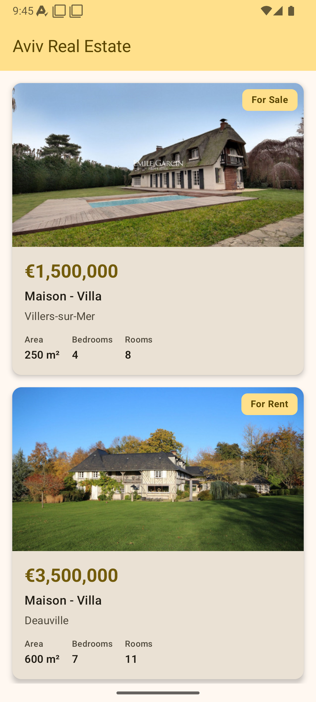
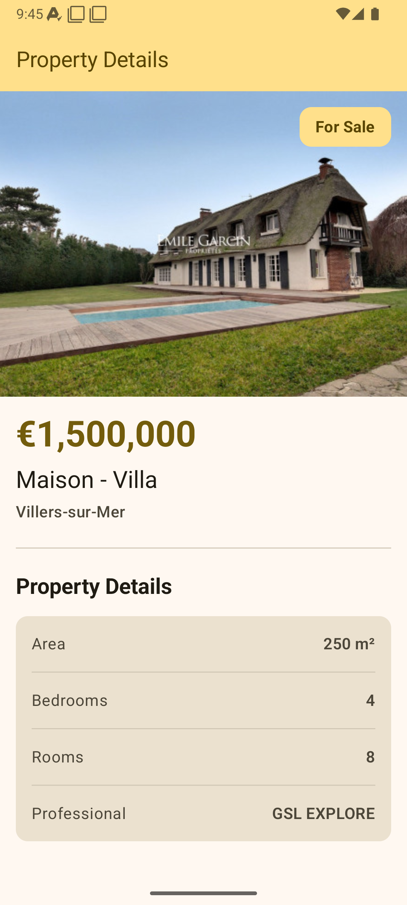
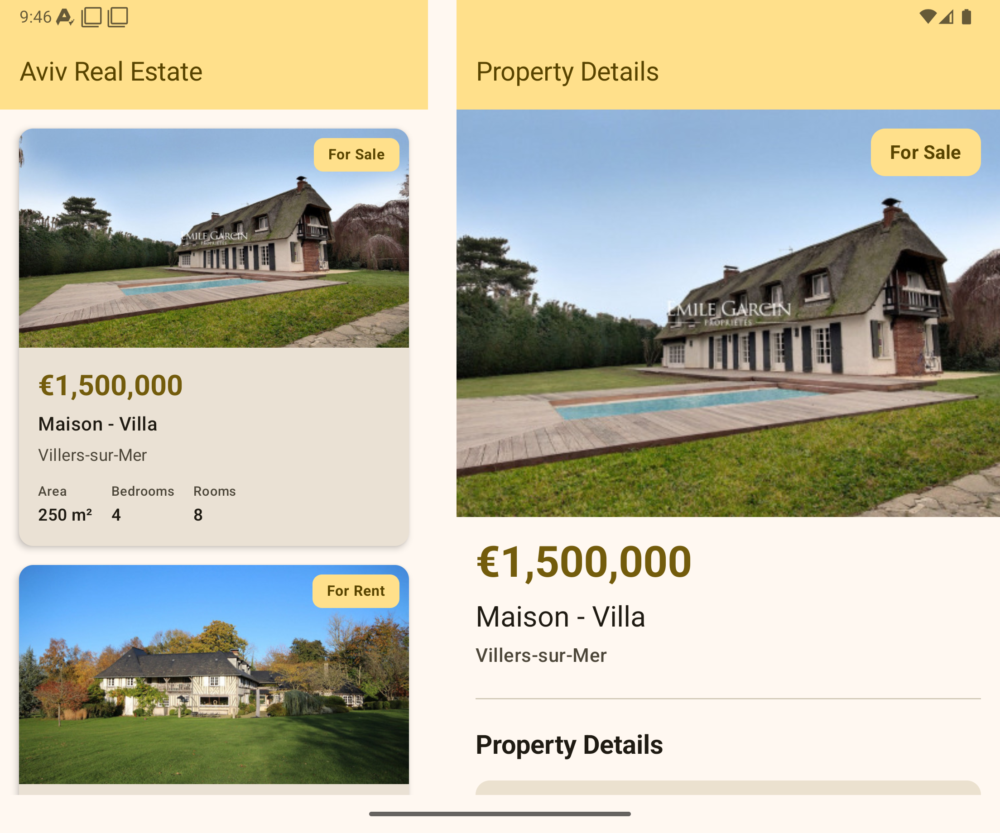

# Aviv Real Estate Listings

A modern Android application for browsing real estate listings, built with Jetpack Compose and following Clean Architecture principles.

<p align="center">
  
  
  
</p>

---

## Key Features

- **Real Estate Listings** - Browse property listings with detailed information including price, area, rooms, and location
- **Adaptive UI** - Responsive layouts for phones and tablets using `ListDetailPaneScaffold`
- **Offline-First Caching** - Cache-first strategy with Room database for seamless offline experience
- **Pull-to-Refresh** - Swipe down to refresh listings with visual progress indicator
- **Error Handling** - User-friendly error messages via Snackbar notifications

---

## Architecture

This project follows **Clean Architecture** principles with clear separation of concerns across three layers:

```
┌─────────────────────────────────────────────────────────────┐
│                    Presentation Layer                        │
│         (Compose UI, ViewModel, State/Actions/Events)        │
├─────────────────────────────────────────────────────────────┤
│                      Domain Layer                            │
│          (Use Cases, Repository Interfaces, Models)          │
├─────────────────────────────────────────────────────────────┤
│                       Data Layer                             │
│        (Repository Impl, Room Database, Ktor API)            │
└─────────────────────────────────────────────────────────────┘
```

### MVI with Contract Pattern

The presentation layer uses **MVI** pattern with a Contract pattern for clear state management:

```kotlin
object AdaptiveScreenContract {
    data class State(...)      // Immutable UI state
    sealed interface Action    // User intentions
    sealed interface Event     // One-time events (e.g., errors)
}
```

### Layer Details

| Layer | Components | Responsibility |
|-------|------------|----------------|
| **Presentation** | Compose UI, ViewModel | UI rendering, state management, user interaction handling |
| **Domain** | Use Cases, Models, Repository Interfaces | Business logic, domain rules |
| **Data** | Repository Impl, DAO, API Service | Data operations, caching, network calls |

### Offline-First Strategy

The `OfflineFirstListingRepository` implements a cache-first approach:

```
┌──────────────┐     ┌──────────────┐     ┌──────────────┐
│   Request    │ ──▶ │ Check Cache  │ ──▶ │ Cache Hit?   │
└──────────────┘     └──────────────┘     └──────┬───────┘
                                                 │
                     ┌───────────────────────────┼────────────────────────────┐
                     │ YES                                                 NO │
                     ▼                                                        ▼
          ┌──────────────────┐                                    ┌──────────────────┐
          │ Emit Cached Data │                                    │  Fetch Network   │
          └──────────────────┘                                    └────────┬─────────┘
                                                                           │
                                                                           ▼
                                                               ┌──────────────────────┐
                                                               │ Update Cache & Emit  │
                                                               └──────────────────────┘
```

1. **Check local cache first** - Query Room database for existing data
2. **Emit cached data immediately** - Provide instant response if available
3. **Fetch fresh data from network** - When cache is empty or on refresh
4. **Update cache with new data** - Persist network response locally
5. **Handle errors gracefully** - Show cached data even when network fails

---

## Tech Stack

| Category | Technology | Version |
|----------|------------|---------|
| **Language** | Kotlin | 2.3.0 |
| **UI Framework** | Jetpack Compose | BOM 2026.01.00 |
| **Design System** | Material 3 | - |
| **Adaptive Layouts** | Material 3 Adaptive | 1.2.0 |
| **Networking** | Ktor Client | 3.3.3 |
| **Database** | Room | 2.8.4 |
| **Dependency Injection** | Dagger Hilt | 2.58 |
| **Async** | Coroutines + Flow | 1.10.2 |
| **Image Loading** | Coil | 2.7.0 |
| **Serialization** | Kotlinx Serialization | 1.9.0 |
| **Testing** | JUnit, MockK, Turbine | - |

---

## Project Structure

```
app/src/main/java/com/perfecta/avivgroupassignment/
├── data/
│   ├── local/
│   │   ├── dao/           # Room DAO interfaces
│   │   ├── entity/        # Database entities
│   │   └── ListingsDatabase.kt
│   ├── remote/
│   │   ├── api/           # Ktor API service
│   │   └── dto/           # Data transfer objects
│   ├── repository/        # Repository implementations
│   └── networking/        # Ktor extensions
├── domain/
│   ├── model/             # Domain models
│   ├── repository/        # Repository interfaces
│   ├── usecase/           # Business use cases
│   └── util/              # Result type, Error types
├── presentation/
│   ├── adaptiveListingScreen/  # Main adaptive UI
│   ├── listings/          # Listing card components
│   ├── details/           # Detail view components
│   ├── navigation/        # Navigation setup
│   └── common/            # Shared UI components
├── di/                    # Hilt dependency modules
└── ui/theme/              # Material 3 theming
```

---

## Testing

Comprehensive unit test coverage across all architecture layers:

### Test Coverage

| Layer | Tests | Description |
|-------|-------|-------------|
| **Domain** | `OfferTypeTest` | Enum mapping and display text verification |
| **Data** | `ListingEntityMapperTest` | Entity to domain model mapping |
| **Data** | `OfflineFirstListingRepositoryTest` | Offline-first logic, cache behavior |
| **Presentation** | `AdaptiveListingsViewModelTest` | State management, actions, events |

### Testing Frameworks

- **JUnit 4** - Test framework
- **MockK** - Kotlin-first mocking library
- **Turbine** - Flow testing library for coroutines

### Run Tests

```bash
# Run all unit tests
./gradlew test

# Run tests with coverage report
./gradlew testDebugUnitTest

# Run specific test class
./gradlew test --tests "*.OfflineFirstListingRepositoryTest"
```

---

## Build & Run

### Requirements

- Android Studio Ladybug or newer
- JDK 11+
- Min SDK: 26 (Android 8.0)
- Target SDK: 36

### Steps

1. **Clone the repository**
   ```bash
   git clone https://github.com/GhiathMutlak/AvivGroupAssignment
   cd AvivGroupAssignment
   ```

2. **Open in Android Studio**
   - File → Open → Select project folder

3. **Sync Gradle**
   - Android Studio will automatically sync dependencies

4. **Run the app**
   - Select a device/emulator
   - Click Run (▶) or `Shift + F10`

### Build Commands

```bash
# Debug build
./gradlew assembleDebug

# Release build
./gradlew assembleRelease

# Clean build
./gradlew clean assembleDebug
```

---

## API Details

| Property | Value |
|----------|-------|
| **Base URL** | `https://gsl-apps-technical-test.dignp.com` |
| **Get Listings** | `GET /listings.json` |
| **Get Listing Details** | `GET /listings/{id}.json` |

---

## License

This project was created as a technical assignment for Aviv Group.
